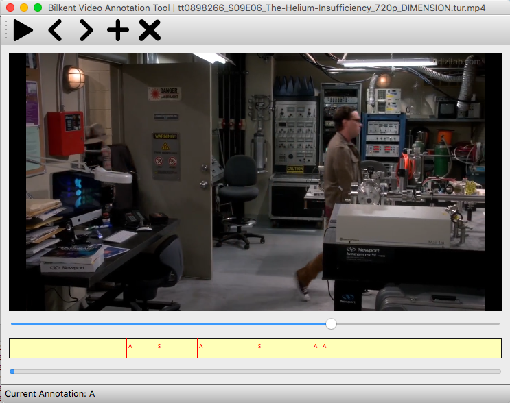

# Bilkent Video Annotation Tool
Bilkent Video Annotation Tool helps to annotate positions in videos possibly for events later to be processed.

### Features
* Developed to be time efficient.
* Supports keyboard shortcuts.
* Saves annotations in JSON format persistently.
* Supports 27 different annotation(event) types at most where each is mapped to an english letter in keyboard.
* Stateful so it continues from the first unannotated video.
* Stores each video's annotation persistently when the video ends or next button is clicked.
* Shows progress at bottom progress bar.



### Shortcuts
* [Space] Annotate current video with current annotation type.
* [BackSpace] Remove all annotations of current video.
* [Enter] Play/Pause video
* [Left Arrow] Show Previous video
* [Right Arrow] Show Next video (goes to first video at end)
* [Any English Letter A-Z] Sets the current annotation type to the pressed key.


### Requirements
* [Anaconda3](https://www.anaconda.com/distribution/#download-section)

### Installing Instructions
* git clone 
* Execute `conda env create -f env.yml`

### Running Instructions
1. Execute `conda activate video-activation-tool` in shell.
2. Execute `python main.py` in shell.
3. Select directory containing videos to be annotated at first file dialog.
4. Select directory to put annotations (should contain current annotations if there is) at second file dialog.

### Annotation Format
```
{
   "name":"video_file_name.avi",
   "path":"/Volumes/NAME/video_file_path.avi",
   "annotations":{
      "F":[
         0.051943399012088776
      ],
      "S":[
         0.14098712801933289
      ],
      "A":[
         0.28347572684288025,
         0.2289014607667923,
         0.194297194480896,
         ... other annoation positions within [0, 1] annotated with A
      ]
   }
}
```
* Annotation positions corresponds to the position in the video mapped to [0, 1].
* Annotated frame corresponds to `annotated_position*total_number_of_frames_in_video`.

### References
Video player icons by https://www.flaticon.com/packs/music-player-icons
App icon:: https://www.flaticon.com/free-icon/pikachu_188987#term=pikachu&page=1&position=1